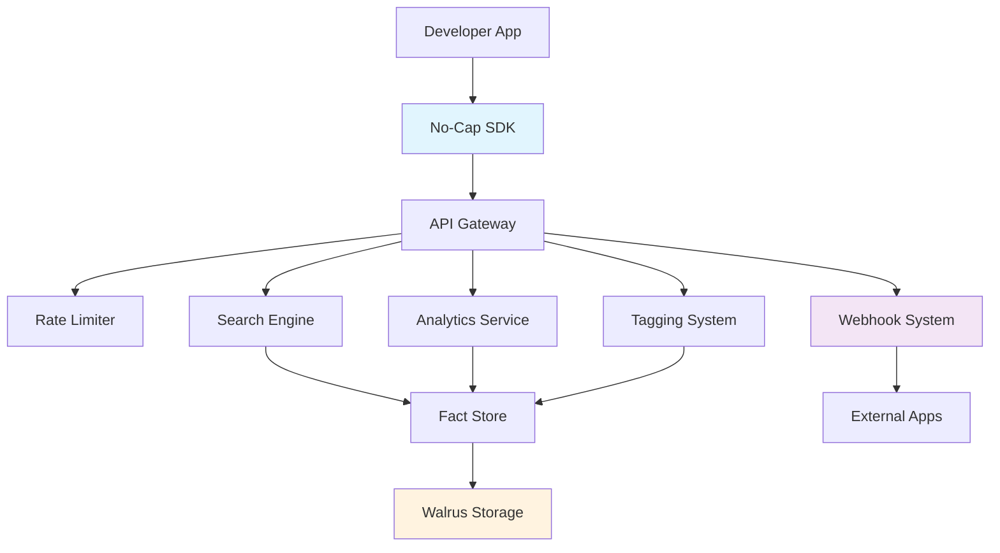

# 🚀 No-Cap Facts API Layer: A Developer's Knowledge Graph

## Vision

Transform verified facts stored on Walrus into a powerful, accessible knowledge graph that developers can integrate into any application. Create the **world's first decentralized fact-checking API** where every piece of information is cryptographically verifiable and permanently stored.

## The Big Idea

Instead of facts living in silos, we're building **infrastructure for truth** - an API layer that makes verified knowledge as easy to access as any web service, but with the permanence and verifiability of blockchain storage.

### What Makes This Special

🔐 **Cryptographically Verifiable**: Every fact is stored on Walrus with content hashes  
🏷️ **Rich Tagging System**: AI-powered categorization with human curation  
📊 **Real-time Analytics**: Track verification trends and topic popularity  
⚡ **Developer-First**: RESTful APIs, SDKs, webhooks, and comprehensive docs  
🌍 **Global Access**: Free tier for developers, enterprise features for scale  
🔍 **Semantic Search**: Find facts by meaning, not just keywords  

## Architecture Overview



## Core Features

### 🔍 Advanced Search API
- **Multi-modal Search**: Keywords, tags, categories, importance scores
- **Faceted Results**: Get related tags, authors, regions automatically  
- **Relevance Scoring**: AI-powered ranking with verification boost
- **Temporal Filtering**: Search by date ranges and recency

```javascript
// Find verified AI research from last 6 months
const results = await sdk.search({
  keywords: 'artificial intelligence transformer models',
  tags: ['ai', 'research'],
  status: ['verified'],
  minImportance: 7,
  dateRange: { from: sixMonthsAgo, to: now },
  sortBy: 'relevance'
});
```

### 🏷️ Intelligent Tagging System
- **6 Tag Categories**: domain, topic, methodology, urgency, region, custom
- **AI Suggestions**: Machine learning suggests tags with confidence scores
- **Community Curation**: Human oversight ensures quality
- **Tag Analytics**: Track trending topics and tag relationships

```javascript
// Get climate change facts with methodology tags
const facts = await sdk.search({
  tags: ['climate-change'],
  categories: ['methodology'], // peer-reviewed, meta-analysis, etc.
  status: ['verified']
});
```

### 📊 Comprehensive Analytics
- **Verification Trends**: Track fact-checking progress over time
- **Topic Popularity**: See what's trending in different domains  
- **Author Insights**: Analyze contributor patterns and accuracy
- **Tag Relationships**: Discover connections between topics

```javascript
// Get insights for the science domain
const analytics = await sdk.getAnalytics('30d', 'domain');
console.log(`Science verification rate: ${analytics.verificationRate}%`);
```

### ⚡ Real-time Webhooks
- **Event Streaming**: Get notified when facts are verified or tagged
- **Smart Filtering**: Subscribe to specific tags or categories
- **Reliable Delivery**: Automatic retries with exponential backoff
- **Signature Verification**: Cryptographic webhook authentication

```javascript
// Get notified about climate research updates
await sdk.registerWebhook({
  url: 'https://your-app.com/webhooks',
  events: ['fact.verified', 'fact.tagged'],
  tags: ['climate-change', 'renewable-energy']
});
```

## Use Cases & Applications

### 🏢 Enterprise Knowledge Management
- **Corporate Fact-Checking**: Verify claims in business documents
- **Regulatory Compliance**: Ensure accuracy in legal filings  
- **Research Integration**: Connect to verified scientific literature
- **Risk Assessment**: Track verified information about markets/competitors

### 📰 Media & Journalism
- **Real-time Verification**: Check breaking news against verified facts
- **Source Augmentation**: Enrich articles with related verified information
- **Trend Analysis**: Track what topics are being fact-checked most
- **Editorial Assistance**: Flag potentially false claims during writing

### 🎓 Education Technology
- **Curriculum Verification**: Ensure educational content accuracy
- **Research Tools**: Help students find verified sources
- **Fact-Check Games**: Gamify learning with verification challenges
- **Academic Integration**: Connect to peer-reviewed research databases

### 🤖 AI & ML Applications
- **Training Data Curation**: Use verified facts for model training
- **Retrieval Augmented Generation**: Enhance LLMs with verified knowledge
- **Fact-Checking Bots**: Build automated verification systems
- **Knowledge Graph Construction**: Create domain-specific knowledge graphs

### 🏛️ Government & Civic Tech
- **Policy Research**: Access verified data for policy decisions
- **Public Information**: Provide citizens with verified government data
- **Misinformation Combat**: Build tools to counter false narratives
- **Transparency Tools**: Track verification of official statements

## API Tiers & Pricing

| Tier | Requests/Hour | Features | Price |
|------|---------------|----------|--------|
| **Free** | 1,000 | Search, basic analytics | $0 |
| **Developer** | 10,000 | All APIs, webhooks, priority support | $29/mo |
| **Business** | 50,000 | Custom tags, bulk operations, SLA | $199/mo |
| **Enterprise** | Unlimited | Dedicated infrastructure, custom integrations | Custom |

## Developer Experience

### 📦 Multi-Language SDKs
```bash
# JavaScript/TypeScript (available now)
npm install @nocap/facts-sdk

# Python (coming soon)
pip install nocap-facts

# Go (coming soon)  
go get github.com/nocap/facts-go

# REST API (always available)
curl -H "Authorization: Bearer $API_KEY" \
  "https://api.nocap.com/search?keywords=quantum+computing"
```

### 🚀 Quick Start Templates
```bash
# Next.js fact-checker app
npx create-nocap-app my-fact-checker --template=nextjs

# Research dashboard
npx create-nocap-app research-dash --template=analytics

# Webhook handler
npx create-nocap-app webhook-handler --template=webhook
```

### 📚 Rich Documentation
- **Interactive API Explorer**: Test endpoints directly in browser
- **Code Examples**: Copy-paste examples in multiple languages
- **Video Tutorials**: Step-by-step integration guides
- **Community Forum**: Developer discussion and support

## Data Quality Guarantees

### ✅ Verification Standards
- **Multi-Source Validation**: Facts require multiple independent verifications
- **Expert Review**: Domain experts validate complex technical claims  
- **Transparency**: All verification steps are publicly auditable
- **Continuous Monitoring**: Facts are re-evaluated as new evidence emerges

### 🔒 Security & Privacy
- **Cryptographic Integrity**: Content hashes prevent tampering
- **Decentralized Storage**: No single point of failure via Walrus
- **Privacy-First**: No tracking of individual user queries
- **Open Source**: Core verification logic is publicly auditable

### 📈 Scale & Performance  
- **Global CDN**: Sub-100ms response times worldwide
- **Elastic Scaling**: Handles traffic spikes automatically
- **99.9% Uptime**: Enterprise-grade reliability with SLA
- **Rate Limiting**: Fair usage policies protect system stability

## Roadmap

### Q1 2024: Foundation
- ✅ Core API endpoints (search, tags, analytics)
- ✅ JavaScript SDK with TypeScript support
- ✅ Webhook system for real-time updates
- ✅ Developer documentation and examples

### Q2 2024: Enhancement
- 🔄 Python and Go SDKs
- 🔄 GraphQL endpoint for flexible queries  
- 🔄 Advanced ML-powered fact suggestions
- 🔄 Browser extension for real-time fact-checking

### Q3 2024: Intelligence
- 📅 Natural language query processing
- 📅 Automated fact relationship discovery
- 📅 Bias detection and diversity metrics
- 📅 Multi-language support (Spanish, French, German)

### Q4 2024: Ecosystem
- 📅 WordPress/CMS plugins
- 📅 Slack/Discord bot integrations  
- 📅 Academic research partnerships
- 📅 Government data integration

## Getting Started

### 1. **Get Your API Key**
```bash
curl -X POST https://api.nocap.com/keys \
  -H "Content-Type: application/json" \
  -d '{"name":"My App","permissions":["read","analytics"]}'
```

### 2. **Install the SDK**
```bash
npm install @nocap/facts-sdk
```

### 3. **Make Your First Request**
```javascript
import { NoCapSDK } from '@nocap/facts-sdk';

const sdk = new NoCapSDK({ apiKey: 'your-key-here' });
const facts = await sdk.searchByKeywords('quantum computing');

console.log(`Found ${facts.length} verified quantum computing facts!`);
```

### 4. **Run the Demo**
```bash
git clone https://github.com/nocap/facts-api
cd facts-api
NOCAP_API_KEY=your-key npm run demo
```

## Community & Support

### 🌟 Open Source Commitment
- **MIT License**: Use freely in commercial and open source projects
- **GitHub Repository**: Contribute features, report bugs, suggest improvements
- **Transparency**: All algorithms and data sources are publicly documented
- **Community Governance**: Major decisions involve community input

### 💬 Developer Community
- **Discord Server**: Real-time chat with developers and team
- **GitHub Discussions**: Technical discussions and feature requests  
- **Monthly Office Hours**: Direct access to engineering team
- **Developer Newsletter**: API updates and best practices

### 🆘 Support Channels
- **Documentation**: Comprehensive guides and API reference
- **Stack Overflow**: Tag questions with `nocap-facts-api`
- **Email Support**: developers@nocap.com for direct assistance
- **Enterprise Support**: Dedicated Slack channels for business customers

## Why This Matters

In an era of information overload and misinformation, developers need access to **verified, structured knowledge**. The No-Cap Facts API doesn't just provide data - it provides **truth with proof**.

Every fact in our system is:
- ✅ **Verified** by multiple independent sources
- 🔗 **Linked** to original sources and evidence  
- 🏷️ **Tagged** for easy discovery and categorization
- 🔒 **Immutable** via cryptographic storage on Walrus
- 📊 **Trackable** with full verification history

### The Future of Knowledge

We're building infrastructure for the **post-misinformation world** - where accessing verified information is as simple as making an API call, but the verification is cryptographically guaranteed and permanently auditable.

**Ready to build with verified facts?** 

🚀 **[Get Started](https://api.nocap.com/signup)** | 📚 **[Documentation](./docs/API_GUIDE.md)** | 💬 **[Discord](https://discord.gg/nocap)**

---

*Built with ❤️ by the No-Cap team. Powered by Walrus for permanent, verifiable storage.*
