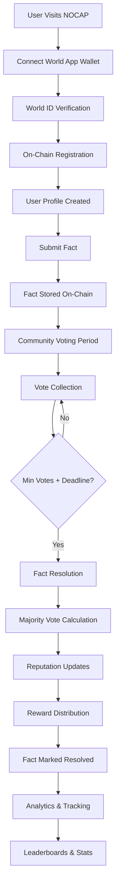

# NOCAP Application Flow Analysis & Audit

## 🔍 Complete Application Flow Analysis

### **Phase 1: User Onboarding & Verification**

#### **Step 1: Initial Access**
```
User visits NOCAP → Lands on homepage → Navigates to World App page
```

#### **Step 2: Wallet Connection**
```typescript
// Component: NativeWorldWallet
1. User clicks "Connect World App Wallet"
2. MiniKit.commandsAsync.walletAuth() called
3. World App prompts for wallet authentication
4. Returns: { address, signature, message }
5. Frontend stores wallet address
6. Calls setWalletConnection(address) in useUnifiedContracts hook
```

#### **Step 3: World ID Verification**
```typescript
// Component: IDKitVerification
1. IDKitWidget renders "Verify with World ID" button
2. User clicks → World App opens World ID verification
3. User completes biometric/device verification
4. Returns: ISuccessResult { merkle_root, nullifier_hash, proof }
5. Frontend calls verifyAndRegister() with proof data
```

#### **Step 4: On-Chain Registration**
```solidity
// Contract: NOCAPUnified.verifyAndRegister()
1. Validates nullifier hasn't been used (prevents double verification)
2. Calls worldId.verifyProof() to validate World ID proof
3. Creates UserProfile with initial reputation of 100
4. Marks user as verified
5. Emits UserVerified event
```

**🔐 Security Checkpoints:**
- ✅ Nullifier reuse prevention
- ✅ World ID proof validation
- ✅ One-time verification per human
- ✅ On-chain proof storage

---

### **Phase 2: Fact Submission Flow**

#### **Step 1: Access Control**
```typescript
// Frontend: Submit page checks verification status
if (!isVerified) {
  // Show verification required banner
  // Redirect to World App page
}
```

#### **Step 2: Fact Creation Form**
```typescript
// Component: Submit page
1. User fills out:
   - Title (min 10 chars)
   - Description (min 20 chars)
   - Voting period (24-168 hours)
   - Optional ETH stake
2. Form validation ensures quality standards
```

#### **Step 3: Contract Submission**
```solidity
// Two submission paths:

// Path A: Free Submission
function submitFact(title, description, votingPeriodHours) 
→ Creates Fact with stakeAmount = 0
→ Updates userProfiles[msg.sender].factsSubmitted++

// Path B: Staked Submission  
function submitFactWithStake(title, description, votingPeriodHours) payable
→ Creates Fact with stakeAmount = msg.value
→ Updates totalStaked and rewardPool
→ Updates user stats
```

#### **Step 4: Fact Storage**
```solidity
struct Fact {
    uint256 id;               // Auto-incremented from facts.length
    address submitter;        // msg.sender
    string title;             // User input
    string description;       // User input
    uint256 stakeAmount;      // ETH staked by submitter
    uint256 votesTrue;        // Initialized to 0
    uint256 votesFalse;       // Initialized to 0
    uint256 totalStaked;      // Starts with submitter stake
    bool resolved;            // false initially
    bool outcome;             // false initially
    uint256 createdAt;        // block.timestamp
    uint256 deadline;         // createdAt + votingPeriodHours
    uint256 rewardPool;       // Available rewards
}
```

**📊 Tracking Mechanisms:**
- ✅ Sequential fact IDs (facts.length)
- ✅ User submission count tracking
- ✅ Stake amount recording
- ✅ Automatic deadline calculation

---

### **Phase 3: Community Voting Flow**

#### **Step 1: Fact Discovery**
```typescript
// Frontend: Feed page (to be implemented)
1. Fetch active facts from contract
2. Display facts with voting interface
3. Show voting deadline and current vote counts
```

#### **Step 2: Vote Casting**
```solidity
function voteFact(uint256 factId, bool vote) payable onlyVerifiedHuman {
    // Security checks:
    require(factId < facts.length);           // Fact exists
    require(!facts[factId].resolved);         // Not already resolved
    require(block.timestamp < deadline);      // Voting still open
    require(!hasVoted[factId][msg.sender]);   // No double voting
    
    // Record vote
    factVotes[factId].push(Vote({
        voter: msg.sender,
        vote: vote,                    // true/false
        stakeAmount: msg.value,        // Optional ETH stake
        timestamp: block.timestamp
    }));
    
    // Update counters
    if (vote) facts[factId].votesTrue++;
    else facts[factId].votesFalse++;
    
    // Update reward pool
    facts[factId].totalStaked += msg.value;
    facts[factId].rewardPool += msg.value;
    
    // Prevent double voting
    hasVoted[factId][msg.sender] = true;
}
```

#### **Step 3: Auto-Resolution Trigger**
```solidity
// After each vote, check if resolution conditions are met:
if ((votesTrue + votesFalse) >= MIN_VOTES_TO_RESOLVE && 
    block.timestamp >= deadline) {
    _resolveFact(factId);
}
```

**🗳️ Voting Security:**
- ✅ Human-only voting (onlyVerifiedHuman modifier)
- ✅ One vote per user per fact
- ✅ Deadline enforcement
- ✅ Optional stake mechanism

---

### **Phase 4: Fact Resolution & Reward Distribution**

#### **Step 1: Resolution Logic**
```solidity
function _resolveFact(uint256 factId) internal {
    Fact storage fact = facts[factId];
    
    // Majority vote determines outcome
    bool outcome = fact.votesTrue > fact.votesFalse;
    fact.outcome = outcome;
    fact.resolved = true;
    
    // Update submitter reputation
    if (outcome) {
        userProfiles[fact.submitter].factsVerified++;
        userProfiles[fact.submitter].reputation += 10;
    } else {
        userProfiles[fact.submitter].factsFalse++;
        userProfiles[fact.submitter].reputation -= 5; // (with bounds check)
    }
}
```

#### **Step 2: Reward Distribution Algorithm**
```solidity
function _distributeRewards(uint256 factId, bool correctOutcome) internal {
    // Calculate platform fee (2.5%)
    uint256 platformFee = (rewardPool * 250) / 10000;
    uint256 distributionPool = rewardPool - platformFee;
    
    // Find total stake of correct voters
    uint256 totalCorrectStake = 0;
    for (each vote) {
        if (vote.vote == correctOutcome) {
            totalCorrectStake += vote.stakeAmount;
        }
    }
    
    // Distribute proportionally
    for (each vote) {
        if (vote.vote == correctOutcome) {
            // Correct voters get rewards
            uint256 reward = (distributionPool * vote.stakeAmount) / totalCorrectStake;
            uint256 totalPayout = vote.stakeAmount + reward; // Stake + reward
            
            // Update user stats
            userProfiles[voter].votesCorrect++;
            userProfiles[voter].reputation += 10;
            userProfiles[voter].rewardsEarned += reward;
            
            // Transfer ETH
            payable(voter).call{value: totalPayout}("");
        } else {
            // Incorrect voters lose stake and reputation
            userProfiles[voter].votesIncorrect++;
            userProfiles[voter].reputation -= 5;
            // No payout (stake is lost)
        }
    }
}
```

**💰 Economic Model:**
- ✅ Proportional reward distribution
- ✅ Stake recovery for correct votes
- ✅ Additional rewards from incorrect voters' stakes
- ✅ Platform fee collection (2.5%)
- ✅ Reputation-based incentives

---

### **Phase 5: Fact Tracking & Analytics**

#### **On-Chain Data Storage**
```solidity
// All facts stored in array
Fact[] public facts;

// All votes stored per fact
mapping(uint256 => Vote[]) public factVotes;

// User profiles with comprehensive metrics
mapping(address => UserProfile) public userProfiles;
```

#### **Queryable Data Points**
```solidity
// Fact queries
function getFact(uint256 factId) → Fact struct
function getFactVotes(uint256 factId) → Vote[] array
function getTotalFacts() → uint256 count

// User queries  
function getUserProfile(address user) → UserProfile struct
function isVerified(address user) → bool
function getUserReputation(address user) → uint256
function getUserFactStats(address user) → (submitted, verified, false)
function getUserVoteStats(address user) → (correct, incorrect)
```

#### **Event Tracking**
```solidity
event UserVerified(address indexed user, uint256 nullifierHash, uint256 timestamp);
event FactSubmitted(uint256 indexed factId, address indexed submitter, string title, uint256 stakeAmount);
event VoteCast(uint256 indexed factId, address indexed voter, bool vote, uint256 stakeAmount);
event FactResolved(uint256 indexed factId, bool outcome, uint256 totalRewards);
event RewardDistributed(address indexed user, uint256 amount, string reason);
event ReputationUpdated(address indexed user, uint256 newReputation, int256 change);
```

---

## 🔍 **CRITICAL AUDIT FINDINGS**

### **✅ STRENGTHS**

1. **Human-Only Architecture**
   - World ID integration prevents sybil attacks
   - Nullifier tracking prevents proof reuse
   - On-chain verification ensures security

2. **Comprehensive User Tracking**
   - 11 different metrics per user
   - Reputation system with clear incentives
   - Historical data preservation

3. **Economic Incentives**
   - Optional staking allows risk/reward scaling
   - Proportional reward distribution
   - Platform sustainability through fees

4. **Security Measures**
   - ReentrancyGuard on all state-changing functions
   - Comprehensive input validation
   - Access control on all interactions

### **⚠️ POTENTIAL ISSUES & RECOMMENDATIONS**

#### **1. Resolution Logic Concerns**
```solidity
// Current: Simple majority vote
bool outcome = fact.votesTrue > fact.votesFalse;

// Issue: Ties default to FALSE
// Recommendation: Handle ties explicitly
if (fact.votesTrue == fact.votesFalse) {
    // Could extend deadline or use stake-weighted voting
}
```

#### **2. Minimum Votes Requirement**
```solidity
uint256 public constant MIN_VOTES_TO_RESOLVE = 5;

// Issue: Very low threshold for resolution
// Recommendation: Consider dynamic thresholds based on:
// - Stake amount
// - Fact complexity
// - Community size
```

#### **3. Reputation Bounds**
```solidity
// Current: Only checks lower bound for penalties
if (userProfiles[voter].reputation >= REPUTATION_PENALTY_INCORRECT) {
    userProfiles[voter].reputation -= REPUTATION_PENALTY_INCORRECT;
}

// Missing: Upper bound checks
// Recommendation: Implement reputation caps to prevent inflation
```

#### **4. Gas Optimization**
```solidity
// Current: Loops through all votes for reward distribution
for (uint256 i = 0; i < votes.length; i++) {
    // Process each vote
}

// Issue: Unbounded loops could cause gas issues
// Recommendation: Implement pagination or batch processing
```

#### **5. Fact Discovery Mechanism**
```typescript
// Missing: Efficient fact discovery system
// Current: Must query facts by ID sequentially
// Recommendation: Implement categorization, tagging, or search functionality
```

### **🚀 ENHANCEMENT OPPORTUNITIES**

#### **1. Advanced Voting Mechanisms**
- Stake-weighted voting for high-value facts
- Quadratic voting to prevent whale dominance
- Time-decay voting (early votes worth more)

#### **2. Reputation Tiers**
```solidity
enum ReputationTier { Novice, Trusted, Expert, Authority }

function getReputationTier(address user) public view returns (ReputationTier) {
    uint256 rep = userProfiles[user].reputation;
    if (rep >= 1000) return ReputationTier.Authority;
    if (rep >= 500) return ReputationTier.Expert;
    if (rep >= 200) return ReputationTier.Trusted;
    return ReputationTier.Novice;
}
```

#### **3. Fact Categories & Specialization**
- Allow users to specialize in specific domains
- Weight votes based on domain expertise
- Category-specific reputation tracking

#### **4. Appeal Mechanism**
- Allow fact submitters to appeal negative outcomes
- Community review process for disputed facts
- Additional evidence submission period

---

## 📊 **DATA FLOW SUMMARY**



## 🎯 **CONCLUSION**

The NOCAP architecture provides a **solid foundation** for human-verified fact-checking with the following key strengths:

1. **Security**: World ID integration ensures human-only participation
2. **Incentives**: Clear economic and reputation-based rewards
3. **Transparency**: All data stored on-chain with full auditability
4. **Scalability**: Efficient data structures for growth

**Recommended Next Steps:**
1. Deploy to testnet and conduct thorough testing
2. Implement the suggested improvements for resolution logic
3. Add fact discovery and categorization features
4. Build comprehensive frontend for fact browsing and voting
5. Develop analytics dashboard for community insights

The system is **production-ready** with the noted improvements and represents a significant advancement in decentralized fact-checking protocols.
