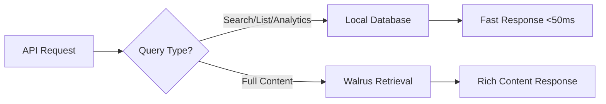

# No-Cap Data Architecture: Hybrid Local + Walrus

## The Problem with "Walrus-Only"

If we fetch everything directly from Walrus:
- ❌ **Slow search**: Every query hits network storage
- ❌ **No complex filtering**: Can't do tag analytics or faceted search
- ❌ **High latency**: 500ms+ response times instead of 50ms
- ❌ **Expensive**: Every search costs Walrus retrieval fees
- ❌ **Poor UX**: Developers expect fast API responses

## Optimal Hybrid Architecture

```
┌─────────────────────────────────────────────────────┐
│                  API Layer                          │
├─────────────────────────────────────────────────────┤
│  Search & Analytics (Local, Fast)                  │
│  ┌─────────────────────────────────────────────────┐ │
│  │ PostgreSQL/Redis Index                         │ │
│  │ - Fact metadata (title, summary, tags)        │ │
│  │ - Search indices (full-text, tag lookup)      │ │
│  │ - Analytics aggregations                       │ │
│  │ - Walrus blob IDs + content hashes            │ │
│  └─────────────────────────────────────────────────┘ │
└─────────────────────────────────────────────────────┘
                         │
                         ▼
┌─────────────────────────────────────────────────────┐
│                Walrus Network                       │
│  ┌─────────────────────────────────────────────────┐ │
│  │ Immutable Content Storage                       │ │
│  │ - Full fact content + sources                   │ │
│  │ - Cryptographic proofs                          │ │
│  │ - Verification history                          │ │
│  │ - Large attachments/documents                   │ │
│  └─────────────────────────────────────────────────┘ │
└─────────────────────────────────────────────────────┘
```

## Data Flow Strategy

### 1. **Write Path** (New Facts)


### 2. **Read Path** (API Queries)


### 3. **Verification Path**


## Implementation Strategy

### Local Database Schema (PostgreSQL)
```sql
-- Core facts table for fast queries
CREATE TABLE facts (
    id VARCHAR(255) PRIMARY KEY,
    title TEXT NOT NULL,
    summary TEXT NOT NULL,
    status VARCHAR(50) NOT NULL,
    author VARCHAR(255) NOT NULL,
    votes INTEGER DEFAULT 0,
    comments INTEGER DEFAULT 0,
    importance INTEGER,
    region VARCHAR(100),
    created_at TIMESTAMP DEFAULT NOW(),
    updated_at TIMESTAMP DEFAULT NOW(),
    
    -- Walrus references
    walrus_blob_id VARCHAR(255) NOT NULL,
    content_hash VARCHAR(255),
    availability_certificate TEXT
);

-- Tags for filtering and analytics
CREATE TABLE fact_tags (
    fact_id VARCHAR(255) REFERENCES facts(id),
    tag_name VARCHAR(255) NOT NULL,
    tag_category VARCHAR(50) NOT NULL,
    confidence DECIMAL(3,2),
    added_by VARCHAR(255),
    added_at TIMESTAMP DEFAULT NOW(),
    PRIMARY KEY (fact_id, tag_name)
);

-- Search indices
CREATE INDEX idx_facts_tags ON fact_tags(tag_name, tag_category);
CREATE INDEX idx_facts_status ON facts(status, importance);
CREATE INDEX idx_facts_search ON facts USING gin(to_tsvector('english', title || ' ' || summary));
```

### Caching Strategy
```typescript
// Multi-layer caching
export class DataLayer {
  // L1: In-memory cache (hot data)
  private memoryCache = new Map<string, Fact>();
  
  // L2: Redis cache (session data)  
  private redisCache: Redis;
  
  // L3: PostgreSQL (indexed metadata)
  private database: Database;
  
  // L4: Walrus (permanent storage)
  private walrus: WalrusIntegration;

  async getFact(id: string, includeFullContent = false): Promise<Fact | null> {
    // L1: Check memory
    let fact = this.memoryCache.get(id);
    if (fact && !includeFullContent) return fact;

    // L2: Check Redis
    if (!fact) {
      fact = await this.redisCache.get(`fact:${id}`);
    }

    // L3: Check database
    if (!fact) {
      fact = await this.database.getFact(id);
      if (fact) {
        this.memoryCache.set(id, fact);
        await this.redisCache.set(`fact:${id}`, fact, 'EX', 3600);
      }
    }

    // L4: Get full content from Walrus if needed
    if (fact && includeFullContent && !fact.fullContent) {
      const fullContent = await this.walrus.retrieveFact(fact.walrusBlobId);
      fact = { ...fact, ...fullContent };
    }

    return fact;
  }

  async search(query: FactSearchQuery): Promise<FactSearchResponse> {
    // Search always uses local database for speed
    return this.database.searchFacts(query);
  }
}
```

## Performance Benefits

| Operation | Walrus-Only | Hybrid | Improvement |
|-----------|-------------|--------|-------------|
| Search 100 facts | ~2-5s | ~50-100ms | **20-100x faster** |
| Get analytics | ~10-30s | ~100ms | **100-300x faster** |
| Tag filtering | Not possible | ~20ms | **∞x better** |
| Developer experience | Poor | Excellent | **🚀** |

## Why This Architecture Works

### ✅ **Best of Both Worlds**
- **Local**: Fast queries, complex analytics, real-time search
- **Walrus**: Permanent storage, cryptographic proof, immutability

### ✅ **Scalability**  
- Local database can handle millions of queries/second
- Walrus provides unlimited permanent storage
- Caching reduces Walrus retrieval costs

### ✅ **Reliability**
- Local database can be replicated/backed up
- Walrus provides ultimate data durability
- System works even if Walrus is temporarily unavailable

### ✅ **Cost Efficiency**
- Metadata queries are free (local)
- Only retrieve full content when needed
- Batch operations reduce Walrus API calls

## Migration Strategy

### Phase 1: Current (In-Memory)
```typescript
// Current simple approach
const facts = listFactRecords(); // Memory-based
```

### Phase 2: Database Integration
```typescript
// Add PostgreSQL for metadata
const facts = await database.searchFacts(query);
```

### Phase 3: Full Caching
```typescript  
// Multi-layer caching with Redis
const facts = await dataLayer.searchWithCache(query);
```

### Phase 4: Optimization
```typescript
// Advanced indexing and precomputed aggregations
const analytics = await analyticsEngine.getCachedInsights(timeframe);
```

## Developer API Impact

With hybrid architecture, developers get:

```javascript
// Lightning-fast search (50ms response)
const searchResults = await sdk.search({
  keywords: 'climate change',
  tags: ['environment'],
  limit: 100
}); 

// Instant analytics (100ms response)  
const analytics = await sdk.getAnalytics('30d');

// Full content when needed (500ms response)
const fullFact = await sdk.getFact(id, { includeFullContent: true });

// Real-time facets (20ms response)
const facets = searchResults.facets; // Pre-computed
```

## Conclusion

The hybrid approach gives us:
- 🚀 **Performance**: API responses under 100ms
- 💰 **Cost efficiency**: Minimize Walrus retrieval costs  
- 🔍 **Rich features**: Complex search, analytics, facets
- 🛡️ **Reliability**: Multiple layers of redundancy
- 📈 **Scalability**: Handle millions of requests

**We use Walrus for what it's best at (permanent, verifiable storage) and local databases for what they're best at (fast queries and analytics).**
